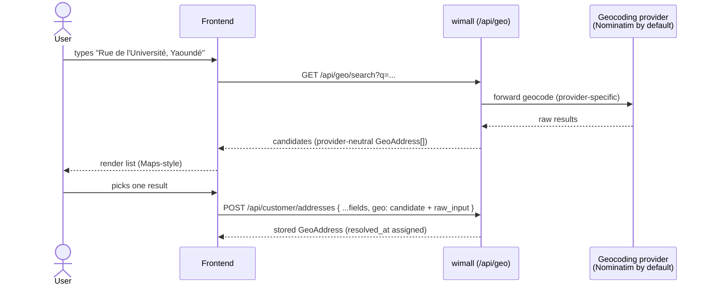

# Geospatial Addresses & Address Search

> Provider-agnostic address search + the shared **GeoAddress** value object that every address in
> wimall now carries. Users keep typing free-form text; the backend turns it into map-grade
> candidates via the active geocoding provider, and the selected candidate is stored with full
> geospatial data — never plain text alone.

All endpoints use the standard envelope (see [../README.md](../README.md)). Auth: **any signed-in role**.

---

## Why this exists

Addresses used to be loose text with, at most, a bare coordinate. There was no formatted address, no
provider place id, and no structured admin breakdown, and nothing turned typed text into map results.
Now:

- **Vendor** business addresses, **agency** headquarters, **customer** saved addresses, order
  **pickup** snapshots, and the order **drop-off** all embed a `GeoAddress`.
- A single geocoding provider (default **Nominatim / OpenStreetMap**, keyless) resolves free-form text
  to candidates. Swapping to Google/Mapbox/HERE/Geoapify is a config change only (`GEO_PROVIDER`) —
  the API shape and every consumer stay identical. **No business logic ever depends on the provider.**

---

## The GeoAddress object

Stored verbatim wherever an address lives. `coordinates` is GeoJSON `[longitude, latitude]`.

```jsonc
{
  "formatted_address": "Rue de l'Université, Yaoundé, Cameroun",
  "coordinates": { "type": "Point", "coordinates": [11.5174, 3.8480] }, // [lng, lat]
  "provider": "nominatim",              // which provider resolved it (informational)
  "provider_place_id": "way:12345678",  // provider's stable id (nullable)
  "components": {                        // structured admin breakdown — every part nullable
    "street": "Rue de l'Université",
    "neighbourhood": "Ngoa-Ekellé",
    "city": "Yaoundé",
    "region": "Centre",
    "country": "Cameroon",
    "country_code": "CM",               // ISO-3166-1 alpha-2
    "postal_code": null
  },
  "raw_input": "Rue de l'Université, Yaoundé", // what the user typed before selecting
  "resolved_at": "2026-07-18T10:20:30.000Z"    // server-assigned on store
}
```

When you **store** a GeoAddress (attach it to a profile address, or send it at checkout), send exactly
the candidate you got from search **plus** `raw_input`. `resolved_at` is server-assigned — do not send it.

---

## Endpoints

### `GET /api/geo/search`

Turn free-form text into ranked candidate locations (the Google-Maps-style search box).

| Query | Type | Notes |
|---|---|---|
| `q` | string (required) | The free-form text the user typed. |
| `limit` | integer 1–20 | Max candidates. Provider default (5) when omitted. |
| `country` | string | Comma-separated ISO-3166-1 alpha-2 codes to bias results, e.g. `cm,ng`. Defaults to the platform bias (`GEO_DEFAULT_COUNTRY_CODES`, `cm`). |
| `lang` | string | Preferred result language, BCP-47 (e.g. `fr`). |

```jsonc
// GET /api/geo/search?q=Rue%20de%20l'Universit%C3%A9,%20Yaound%C3%A9&limit=5
{
  "success": true,
  "data": {
    "provider": "nominatim",
    "query": "Rue de l'Université, Yaoundé",
    "results": [
      {
        "formatted_address": "Rue de l'Université, Yaoundé, Cameroun",
        "coordinates": { "type": "Point", "coordinates": [11.5174, 3.8480] },
        "provider": "nominatim",
        "provider_place_id": "way:12345678",
        "components": { "street": "Rue de l'Université", "city": "Yaoundé", "region": "Centre", "country": "Cameroon", "country_code": "CM", "neighbourhood": null, "postal_code": null }
      }
      // …more candidates
    ]
  }
}
```

Each `results[]` entry is a **candidate** — the GeoAddress shape minus `raw_input`/`resolved_at`. To
store it, add `raw_input` (the user's `q`) and submit it to the owning endpoint (below).

### `GET /api/geo/reverse`

Turn a coordinate into its best-matching address (e.g. "use my current location").

| Query | Type | Notes |
|---|---|---|
| `lat` | number −90..90 (required) | Latitude. |
| `lng` | number −180..180 (required) | Longitude. |

```jsonc
// GET /api/geo/reverse?lat=3.8480&lng=11.5174
{ "success": true, "data": { "provider": "nominatim", "result": { /* one candidate, or null */ } } }
```

### Error codes

| `error.code` | Status | Meaning |
|---|---|---|
| `GEO_PROVIDER_UNAVAILABLE` | 503 | Provider unreachable (network/timeout). Geo is off the critical path — retry; checkout/profile still work. |
| `GEO_SEARCH_FAILED` | 502 | Provider returned an error / unparseable response. |
| `GEO_PROVIDER_NOT_CONFIGURED` | 500 | Configured provider has no adapter/credentials in this build. |
| `VALIDATION_ERROR` | 400 | Bad query params (missing `q`, out-of-range `lat`/`lng`). |

---

## Where a GeoAddress is stored

Attach the selected candidate (as a `geo` field, or as the checkout drop-off) to any of these. The
legacy loose fields (`address_line1`, `city`, `location`, …) are **kept** for backward compatibility;
`geo` is the canonical record.

| Site | Endpoint | Field |
|---|---|---|
| Customer saved address | `POST /api/customer/addresses` | `geo` |
| Vendor business address | `PATCH /api/vendor/profile` (and onboarding step 3) | `business_addresses[].geo` |
| Agency HQ address | agency onboarding step 1 / `PATCH` profile | `headquarters_addresses[].geo` (`location` stays required) |
| Pickup location | derived from the vendor business address; **snapshotted** onto the order at checkout | `items[].delivery.pickup_location.address_snapshot.geo` |
| Drop-off | `POST /api/customer/orders/checkout` | `deliveryAddress` **or** `deliveryAddressId` → snapshotted to `order.delivery_address` |

### Checkout drop-off

`POST /api/customer/orders/checkout` now accepts (physical carts):

```jsonc
{
  "paymentMethod": "online",
  // ONE of the two (or neither → falls back to the customer's default saved address):
  "deliveryAddressId": "665f...c1",     // id of one of the customer's saved addresses
  "deliveryAddress": { /* a selected GeoAddress + raw_input */ }
}
```

The resolved GeoAddress is frozen onto every order in the checkout group as `order.delivery_address`,
so a later edit to the customer's saved addresses never rewrites past orders. Digital orders ignore it.

---

## Workflow — type → search → select → store



## Workflow — drop-off snapshot at checkout

```mermaid
sequenceDiagram
    actor Customer
    participant FE as Frontend
    participant API as wimall
    participant DB as MongoDB

    Customer->>FE: choose saved address or search a new one
    FE->>API: POST /api/customer/orders/checkout { deliveryAddressId | deliveryAddress }
    API->>API: resolve → GeoAddress (inline > addressId > default saved)
    API->>DB: create orders, freeze order.delivery_address (per order)
    API-->>FE: orders (each with durable geocoded drop-off)
    note over API,DB: geo-tracker may later read the drop-off coordinate for routing —<br/>no event-shape change; wimall owns geocoding, geo-tracker owns routing.
```

---

## Provider configuration

Selected once at boot from env (see `.env.example`). Mirrors the storage-provider pattern.

| Env | Default | Notes |
|---|---|---|
| `GEO_PROVIDER` | `nominatim` | `nominatim` \| `google` \| `mapbox` \| `here` \| `geoapify`. Only `nominatim` has an adapter in this build. |
| `GEO_REQUEST_TIMEOUT_MS` | `5000` | Per-request timeout. |
| `GEO_DEFAULT_LIMIT` | `5` | Default candidate count. |
| `GEO_DEFAULT_COUNTRY_CODES` | `cm` | Comma-separated ISO-2 bias. Blank = worldwide. |
| `GEO_NOMINATIM_BASE_URL` | public OSM | Or a self-hosted mirror. |
| `GEO_NOMINATIM_USER_AGENT` | identifying UA | **Required by Nominatim's usage policy.** |

The seam is `IGeocodingProvider` (`src/core/geocoding/`). Adding Google/Mapbox/HERE/Geoapify is one
adapter file + a factory case; **no consumer changes**. Because geocoding is an address concern and
wimall owns addresses, the whole provider abstraction lives in wimall — geo-tracker owns live
positions and road networks, not address resolution.
