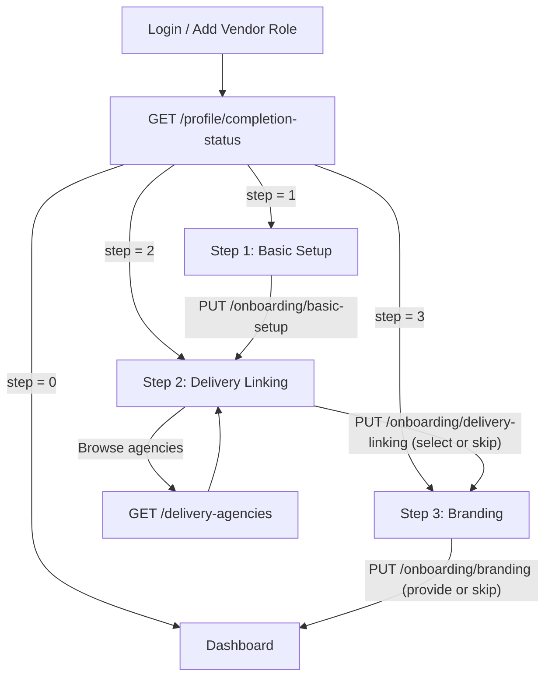

# Vendor Onboarding API Documentation

This documentation provides frontend developers with the complete specifications needed to build the vendor onboarding flow.

The flow uses dedicated `PUT` endpoints for each step — the same pattern used by the [Delivery Agency Onboarding](../agency/onboarding.md). Each step can be re-submitted to update its data without resetting progress.

---

## Overview

The onboarding is a **3-step process** entered after the user adds the "vendor" role to their account:

| # | Step | Endpoint | Required? |
|---|------|----------|-----------|
| 1 | Basic Setup | `PUT /api/vendor/onboarding/basic-setup` | Yes |
| 2 | Delivery Linking | `PUT /api/vendor/onboarding/delivery-linking` | No (skippable) |
| 3 | Branding | `PUT /api/vendor/onboarding/branding` | No (skippable) |

`onboarding_step` values returned in the profile:

| Value | Meaning |
|-------|---------|
| `1` | Awaiting Basic Setup |
| `2` | Awaiting Delivery Linking |
| `3` | Awaiting Branding |
| `0` | **Onboarding Complete** → redirect to dashboard |

---

## 1. Check Onboarding Status

Call this on every login to determine which onboarding screen to show.

- **Endpoint**: `GET /api/vendor/profile/completion-status`
- **Auth**: Yes (Vendor role)

### Response

```json
{
  "success": true,
  "data": {
    "onboardingStep": 1,
    "isComplete": false,
    "missingFields": ["country", "payout_details"],
    "stepLabel": "Basic Setup"
  }
}
```

**Frontend routing logic:**

```
onboardingStep === 0  →  /dashboard                 (onboarding complete)
onboardingStep === 1  →  /onboarding/basic-setup
onboardingStep === 2  →  /onboarding/delivery-linking
onboardingStep === 3  →  /onboarding/branding
```

---

## 2. Submit Onboarding Steps

### Optimistic Concurrency (Optional)

Any `PUT` step endpoint accepts an optional `version` integer field. If supplied, the backend checks that it matches the profile's current `version` before writing. If it doesn't match (another session submitted changes simultaneously), the request fails with `VENDOR_ONBOARDING_CONCURRENT_MODIFICATION (409)`.

**Best practice:** Always pass `version` from the last profile response you received. On success, the response includes the incremented `version` — store it for the next write.

### Re-edit Behaviour

Once a step is marked complete you may re-submit its endpoint to update the data. The backend saves the new values but does **not** reset `onboarding_step`. This means:

- Submitting Step 1 again when you're on Step 3 → data saved, `onboarding_step` stays `3`.
- Submitting Step 3 at any point → data saved, `onboarding_step` unchanged (unless this is the final step, in which case it advances to `0`).

---

### Step 1: Basic Setup (Required)

- **Endpoint**: `PUT /api/vendor/onboarding/basic-setup`
- **Auth**: Yes (Vendor role)
- **Prerequisite**: Vendor profile exists (created via add-role flow)

Captures the vendor's country, timezone, and payout method.

#### Request Body

```json
{
  "country": "CM",
  "timezone": "Africa/Douala",
  "payout_details": [
    {
      "method": "mobile_money",
      "mobile_money": {
        "provider": "MTN Mobile Money",
        "phone_number": "+237670000000",
        "account_name": "Tech Solutions Sarl"
      },
      "bank": null
    }
  ]
}
```

#### Field Reference

| Field | Type | Required? | Validation | Notes |
|-------|------|-----------|------------|-------|
| `country` | `string` | Yes | Exactly 2 chars, ISO-2 country code | Auto-uppercased (e.g. `"CM"`, `"NG"`). |
| `timezone` | `string` | Yes | Min 1 char, IANA timezone string | E.g. `"Africa/Douala"`, `"Africa/Lagos"`. |
| `payout_details` | `object[]` | Yes | Min 1 entry, Max 3 entries | Ordered array — index 0 is the preferred method. Same schema as agency payout. |
| `payout_details[].method` | `string` | Yes | Enum: `"mobile_money"` or `"bank"` | Determines which sub-object is required. |
| `payout_details[].mobile_money` | `object \| null` | Conditional | Required if `method === "mobile_money"` | See sub-fields below. |
| `payout_details[].bank` | `object \| null` | Conditional | Required if `method === "bank"` | See sub-fields below. |
| `version` | `number (integer)` | No | Must match profile `version` if provided | Optimistic concurrency guard. |

**`mobile_money` sub-fields:**

| Field | Type | Required? | Validation |
|-------|------|-----------|------------|
| `provider` | `string` | Yes | Min 1 char. E.g. `"MTN Mobile Money"`, `"Orange Money"` |
| `phone_number` | `string` | Yes | Valid phone format |
| `account_name` | `string` | Yes | Min 1 char |

**`bank` sub-fields:**

| Field | Type | Required? | Validation |
|-------|------|-----------|------------|
| `bank_name` | `string` | Yes | Min 1 char |
| `account_number` | `string` | Yes | Min 1 char |
| `account_name` | `string` | Yes | Min 1 char |
| `country` | `string` | Yes | Min 1 char. ISO country code recommended (e.g. `"CM"`) |

#### Success Response (`200 OK`)

```json
{
  "success": true,
  "message": "Basic setup completed",
  "data": {
    "profile": { "..." : "full vendor profile object" },
    "completionStatus": {
      "onboardingStep": 2,
      "isComplete": false,
      "missingFields": [],
      "stepLabel": "Delivery Linking (Optional)"
    }
  }
}
```

---

### Step 2: Delivery Linking (Optional / Skippable)

- **Endpoint**: `PUT /api/vendor/onboarding/delivery-linking`
- **Auth**: Yes (Vendor role)
- **Prerequisite**: Step 1 completed

Allows the vendor to select a default delivery agency for physical product orders. **Service-only vendors should skip this step.**

> [!TIP]
> Before submitting this step, use `GET /api/vendor/delivery-agencies` to show the vendor a browsable, filterable list of available agencies. See the [Delivery Agencies](./delivery-agencies.md) documentation for full details on search, filtering, and pagination.

#### Request Body — Selecting an agency

```json
{
  "default_delivery_agency_id": "683abc1234567890abcdef01"
}
```

#### Request Body — Skipping (service-only vendors)

```json
{
  "skip": true
}
```

#### Field Reference

| Field | Type | Required? | Validation | Notes |
|-------|------|-----------|------------|-------|
| `skip` | `boolean` | No | Defaults to `false` | Set `true` to skip without selecting an agency. |
| `default_delivery_agency_id` | `string` | Conditional | Min 1 char. Must be a valid agency ID. | Required if `skip` is `false` or not provided. |
| `version` | `number (integer)` | No | Must match profile `version` if provided | Optimistic concurrency guard. |

> **Validation rules:**
> - Either `skip` must be `true` **or** `default_delivery_agency_id` must be provided — you cannot submit an empty form.
> - When an agency ID is provided, the backend validates that the agency exists, is NOT inactive, and has completed its own onboarding (`onboarding_step === 0`). An invalid ID returns a `404` or `400` error.

#### Success Response (`200 OK`)

```json
{
  "success": true,
  "message": "Delivery linking completed",
  "data": {
    "profile": { "..." : "full vendor profile object" },
    "completionStatus": {
      "onboardingStep": 3,
      "isComplete": false,
      "missingFields": [],
      "stepLabel": "Branding (Optional)"
    }
  }
}
```

---

### Step 3: Branding (Optional / Skippable)

- **Endpoint**: `PUT /api/vendor/onboarding/branding`
- **Auth**: Yes (Vendor role)
- **Prerequisite**: Step 2 completed or skipped

Captures the vendor's branding (logo, cover image) and business addresses. This step is optional — the user can skip it and onboarding will be marked as complete.

#### Request Body — Providing Data

```json
{
  "branding": {
    "logo_url": "https://cdn.example.com/vendors/tech-solutions/logo.png",
    "cover_image_url": "https://cdn.example.com/vendors/tech-solutions/cover.jpg"
  },
  "business_addresses": [
    {
      "label": "Main Office",
      "address_line1": "123 Commerce Ave, Akwa",
      "address_line2": "Suite 4B",
      "city": "Douala",
      "state": "Littoral",
      "location": null
    }
  ]
}
```

#### Request Body — Skipping

```json
{
  "skip": true
}
```

#### Field Reference

| Field | Type | Required? | Validation | Notes |
|-------|------|-----------|------------|-------|
| `skip` | `boolean` | No | Defaults to `false` | Set `true` to skip and finalize onboarding. |
| `version` | `number (integer)` | No | Must match profile `version` if provided | Optimistic concurrency guard. Ignored if `skip: true`. |
| `branding` | `object` | No | See sub-fields | Ignored if `skip: true`. |
| `branding.logo_url` | `string \| null` | No | Must be a valid absolute URL | Vendor logo image. |
| `branding.cover_image_url` | `string \| null` | No | Must be a valid absolute URL | Cover/banner image. |
| `business_addresses` | `object[]` | No | See sub-fields | Vendor's physical locations. Ignored if `skip: true`. |
| `business_addresses[].label` | `string` | Yes | Min 1, Max 50 chars | E.g. `"Main Office"`, `"Warehouse"`. |
| `business_addresses[].address_line1` | `string` | Yes | Min 1, Max 200 chars | Primary street address. |
| `business_addresses[].address_line2` | `string \| null` | No | Max 200 chars | Secondary address (suite, floor, etc.). |
| `business_addresses[].city` | `string` | Yes | Min 1, Max 100 chars | City name. |
| `business_addresses[].state` | `string \| null` | No | Max 100 chars | State or region. |
| `business_addresses[].location` | `GeoPoint \| null` | No | `{ type: "Point", coordinates: [lng, lat] }` | Geographic coordinates for map display. |

#### Success Response (`200 OK`)

```json
{
  "success": true,
  "message": "Branding setup completed",
  "data": {
    "profile": { "..." : "full vendor profile object" },
    "completionStatus": {
      "onboardingStep": 0,
      "isComplete": true,
      "missingFields": [],
      "stepLabel": "Onboarding Complete"
    }
  }
}
```

---

## 3. Successful Step Response Shape

All `PUT` step submissions return the same response structure:

```typescript
{
  success: true;
  message: string;
  data: {
    profile: GetVendorProfileResponseDto;      // Full updated vendor profile
    completionStatus: VendorCompletionStatusDto; // Current step + missing fields
  };
}
```

Use `data.completionStatus.onboardingStep` to determine which screen to navigate to next:

| `onboardingStep` | Action |
|------------------|--------|
| `0` | Redirect to dashboard — onboarding complete |
| `1` | Show Basic Setup form |
| `2` | Show Delivery Linking form |
| `3` | Show Branding form |

---

## 4. Error Handling

### Validation Errors (`400 VALIDATION_ERROR`)

Returned when the request body fails Zod schema validation.

```json
{
  "success": false,
  "error": {
    "code": "VALIDATION_ERROR",
    "message": "Request validation failed",
    "details": [
      {
        "field": "default_delivery_agency_id",
        "message": "Either skip must be true or a default_delivery_agency_id must be provided"
      }
    ]
  }
}
```

### Logic & State Errors

| HTTP | Code | When it occurs | Suggested frontend action |
|------|------|----------------|---------------------------|
| `400` | `DELIVERY_AGENCY_NOT_FOUND` | The delivery agency ID submitted in Step 2 is inactive or has not completed onboarding. | Show error message and let user pick a different agency. |
| `404` | `AUTH_USER_NOT_FOUND` | No vendor profile exists for the authenticated user. | Redirect to the add-role or registration flow. |
| `404` | `DELIVERY_AGENCY_NOT_FOUND` | The delivery agency ID submitted in Step 2 does not exist. | Show error message and let user pick a different agency. |
| `409` | `VENDOR_ONBOARDING_CONCURRENT_MODIFICATION` | The `version` you sent does not match the server's current value — another session saved changes in the meantime. | Show a prompt: *"Your profile was modified elsewhere. Please refresh and try again."* Then re-fetch the profile, store the new `version`, and let the user re-submit. |
| `500` | `INTERNAL_ERROR` | Unexpected server error. | Show generic error message. |

---

## 5. Endpoint Summary

| Method | Path | Description |
|--------|------|-------------|
| `GET` | `/api/vendor/profile/completion-status` | Check current onboarding step and missing fields |
| `PUT` | `/api/vendor/onboarding/basic-setup` | Submit Step 1: country, timezone, payout details |
| `PUT` | `/api/vendor/onboarding/delivery-linking` | Submit Step 2: select delivery agency or skip |
| `PUT` | `/api/vendor/onboarding/branding` | Submit Step 3: branding, business addresses, or skip |
| `GET` | `/api/vendor/delivery-agencies` | Browse available delivery agencies ([full docs](./delivery-agencies.md)) |

---

## 6. Complete Onboarding Flow Diagram



---

## 7. Migration Note: Old vs New Endpoint Pattern

> [!WARNING]
> The previous single-endpoint pattern (`PATCH /api/vendor/onboarding/step` with `{ step: N, ...data }`) has been **removed**. All vendor onboarding now uses the per-step `PUT` endpoints documented above. Frontend code referencing the old endpoint must be updated.

**Before (deprecated):**

```json
PATCH /api/vendor/onboarding/step
{ "step": 1, "country": "CM", "timezone": "Africa/Douala", "payout_details": [...] }
```

**After (current):**

```json
PUT /api/vendor/onboarding/basic-setup
{ "country": "CM", "timezone": "Africa/Douala", "payout_details": [...] }
```

No `step` field in the body — the endpoint itself determines the step.
