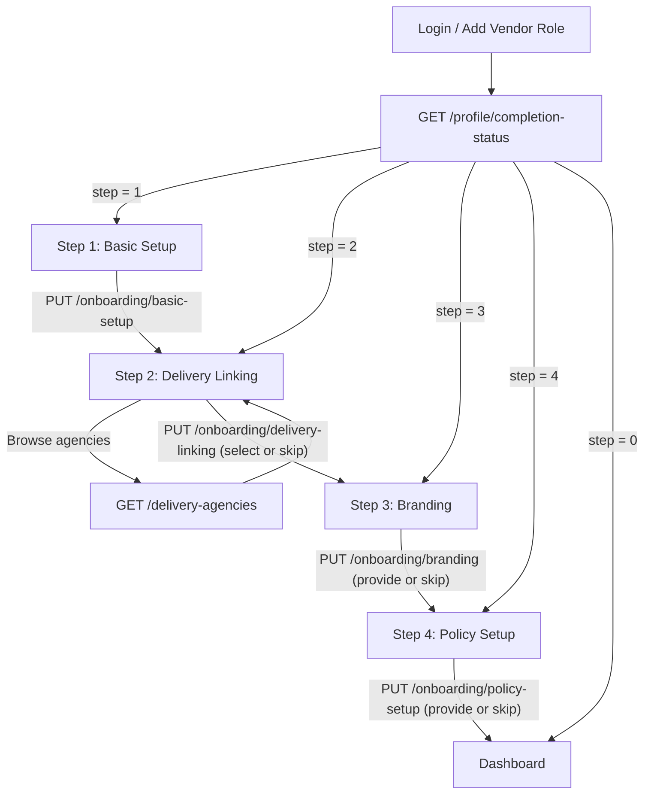

# Vendor Onboarding API Documentation

This documentation provides frontend developers with the complete specifications needed to build the vendor onboarding flow.

The flow uses dedicated `PUT` endpoints for each step — the same pattern used by the [Delivery Agency Onboarding](../agency/onboarding.md). Each step can be re-submitted to update its data without resetting progress.

---

## Overview

The onboarding is a **4-step process** entered after the user adds the "vendor" role to their account:

| # | Step | Endpoint | Required? |
|---|------|----------|-----------|
| 1 | Basic Setup | `PUT /api/vendor/onboarding/basic-setup` | Yes |
| 2 | Delivery Linking | `PUT /api/vendor/onboarding/delivery-linking` | No (skippable) |
| 3 | Branding | `PUT /api/vendor/onboarding/branding` | No (skippable) |
| 4 | Policy Setup | `PUT /api/vendor/onboarding/policy-setup` | No (skippable) |

`onboarding_step` values returned in the profile:

| Value | Meaning |
|-------|---------|
| `1` | Awaiting Basic Setup |
| `2` | Awaiting Delivery Linking |
| `3` | Awaiting Branding |
| `4` | Awaiting Policy Setup |
| `0` | **Onboarding Complete** → redirect to dashboard |

---

## 1. Check Onboarding Status

Call this on every login to determine which onboarding screen to show.

Two endpoints are available — use the richer one (`/onboarding/status`) for building the step-indicator UI.

### Option A — Rich status (recommended)

- **Endpoint**: `GET /api/vendor/onboarding/status`
- **Auth**: Yes (Vendor role)

#### Response

```json
{
  "success": true,
  "data": {
    "currentStep": 1,
    "currentStepLabel": "Basic Setup",
    "isComplete": false,
    "progressPercent": 0,
    "completedFields": [],
    "missingFields": ["country", "payout_details"],
    "steps": [
      { "step": 1, "label": "Basic Setup",                 "status": "current",   "required": true  },
      { "step": 2, "label": "Delivery Linking (Optional)", "status": "pending",   "required": false },
      { "step": 3, "label": "Branding (Optional)",         "status": "pending",   "required": false },
      { "step": 4, "label": "Policy Setup (Optional)",     "status": "pending",   "required": false }
    ],
    "warnings": [
      "KYC verification is pending. Your account may have limited functionality until verified by admin."
    ]
  }
}
```

**`steps[].status` meanings:**

| Value | Meaning |
|-------|---------|
| `"completed"` | Step was already submitted successfully. |
| `"current"` | This is the step the user should complete next. |
| `"pending"` | Step is locked until prior required steps are done. |

### Option B — Simple status

- **Endpoint**: `GET /api/vendor/profile/completion-status`
- **Auth**: Yes (Vendor role)

#### Response

```json
{
  "success": true,
  "data": {
    "onboardingStep": 1,
    "isComplete": false,
    "missingFields": ["country", "payout_details"],
    "stepLabel": "Basic Setup"
  }
}
```

**Frontend routing logic:**

```
currentStep === 0  →  /dashboard                 (onboarding complete)
currentStep === 1  →  /onboarding/basic-setup
currentStep === 2  →  /onboarding/delivery-linking
currentStep === 3  →  /onboarding/branding
currentStep === 4  →  /onboarding/policy-setup
```

---

## 2. Submit Onboarding Steps

### Optimistic Concurrency (Optional)

Any `PUT` step endpoint accepts an optional `version` integer field. If supplied, the backend checks that it matches the profile's current `version` before writing. If it doesn't match (another session submitted changes simultaneously), the request fails with `VENDOR_ONBOARDING_CONCURRENT_MODIFICATION (409)`.

**Best practice:** Always pass `version` from the last profile response you received. On success, the response includes the incremented `version` — store it for the next write.

### Re-edit Behaviour

Once a step is marked complete you may re-submit its endpoint to update the data. The backend saves the new values but does **not** reset `onboarding_step`. This means:

- Submitting Step 1 again when you're on Step 2, 3, or 4 → data saved, `onboarding_step` stays unchanged.
- Submitting Step 2 again when you're on Step 3 or 4 → agency ID updated (or no-op if `skip: true`), `onboarding_step` stays unchanged.
- Submitting Step 3 again when you're on Step 4 → branding/addresses saved, `onboarding_step` stays `4`.
- Submitting Step 4 completes onboarding → `onboarding_step` advances to `0`.

> **Note:** Once onboarding is fully complete (`onboarding_step === 0`), all onboarding step endpoints return `409 VENDOR_ONBOARDING_ALREADY_COMPLETED`. Use the general profile update endpoint (`PATCH /api/vendor/profile`) to make changes instead.

---

### Step 1: Basic Setup (Required)

- **Endpoint**: `PUT /api/vendor/onboarding/basic-setup`
- **Auth**: Yes (Vendor role)
- **Prerequisite**: Vendor profile exists (created via add-role flow)

Captures the vendor's country, timezone, and payout method.

#### Request Body

```json
{
  "country": "CM",
  "timezone": "Africa/Douala",
  "payout_details": [
    {
      "method": "mobile_money",
      "mobile_money": {
        "provider": "MTN Mobile Money",
        "phone_number": "+237670000000",
        "account_name": "Tech Solutions Sarl"
      },
      "bank": null
    }
  ]
}
```

#### Field Reference

| Field | Type | Required? | Validation | Notes |
|-------|------|-----------|------------|-------|
| `country` | `string` | Yes | Exactly 2 chars, ISO-2 country code | Auto-uppercased (e.g. `"CM"`, `"NG"`). **Locks at onboarding completion** — it can still be corrected on step re-edits while onboarding is in progress, but never afterwards (`403 PROFILE_COUNTRY_IMMUTABLE` on the profile PATCH). Correcting it is rejected (`400 ADDRESS_COUNTRY_MISMATCH`) if geocoded business addresses added in Step 3 already resolve in the old country. All business addresses must be located within it. |
| `timezone` | `string` | Yes | Min 1 char, IANA timezone string | E.g. `"Africa/Douala"`, `"Africa/Lagos"`. |
| `payout_details` | `object[]` | Yes | Min 1 entry, Max 3 entries | Ordered array — index 0 is the preferred method. Same schema as agency payout. |
| `payout_details[].method` | `string` | Yes | Enum: `"mobile_money"` or `"bank"` | Determines which sub-object is required. |
| `payout_details[].mobile_money` | `object \| null` | Conditional | Required if `method === "mobile_money"` | See sub-fields below. |
| `payout_details[].bank` | `object \| null` | Conditional | Required if `method === "bank"` | See sub-fields below. |
| `version` | `number (integer)` | No | Must match profile `version` if provided | Optimistic concurrency guard. |

**`mobile_money` sub-fields:**

| Field | Type | Required? | Validation |
|-------|------|-----------|------------|
| `provider` | `string` | Yes | Min 1 char. E.g. `"MTN Mobile Money"`, `"Orange Money"` |
| `phone_number` | `string` | Yes | Valid phone format |
| `account_name` | `string` | Yes | Min 1 char |

**`bank` sub-fields:**

| Field | Type | Required? | Validation |
|-------|------|-----------|------------|
| `bank_name` | `string` | Yes | Min 1 char |
| `account_number` | `string` | Yes | Min 1 char |
| `account_name` | `string` | Yes | Min 1 char |
| `country` | `string` | Yes | Min 1 char. ISO country code recommended (e.g. `"CM"`) |

#### Success Response (`200 OK`)

```json
{
  "success": true,
  "message": "Basic setup completed",
  "data": {
    "profile": { "..." : "full vendor profile object" },
    "completionStatus": {
      "onboardingStep": 2,
      "isComplete": false,
      "missingFields": [],
      "stepLabel": "Delivery Linking (Optional)"
    }
  }
}
```

---

### Step 2: Delivery Linking (Optional / Skippable)

- **Endpoint**: `PUT /api/vendor/onboarding/delivery-linking`
- **Auth**: Yes (Vendor role)
- **Prerequisite**: Step 1 completed

> [!IMPORTANT]
> **This step no longer selects a default delivery agency directly.** It is now a plain step-advance — calling it just moves onboarding to Step 3. Selecting an agency requires that agency's **consent**: see [Agency Connections](./agency-connections.md) — the vendor searches agencies (`GET /api/vendor/agency-connections/browse`) and sends connection requests (`POST /api/vendor/agency-connections`), independently of this onboarding step (an agency's approval is async and can't block onboarding progress). **The vendor's `default_delivery_agency_id` is set automatically the first time any connection is approved** — no explicit "set default" call needed for the first one. The vendor can change their default afterward via [`PUT /api/vendor/profile/default-delivery-agency`](./profile.md#put-apivendorprofiledefault-delivery-agency), e.g. once they have several active contracts.
>
> This applies equally to service-only vendors — there's nothing to configure here either way, so there is no meaningful difference between "skipping" and "not skipping" anymore.

#### Request Body

```json
{}
```

`skip` is still accepted for backward compatibility with existing frontend calls, but no longer changes behavior:

```json
{
  "skip": true
}
```

#### Field Reference

| Field | Type | Required? | Validation | Notes |
|-------|------|-----------|------------|-------|
| `skip` | `boolean` | No | Defaults to `false` | **Deprecated** — accepted but ignored. Kept only so existing clients don't break. |
| `version` | `number (integer)` | No | Must match profile `version` if provided | Optimistic concurrency guard. |

Any other field (e.g. a legacy client still sending `default_delivery_agency_id`) is silently ignored — it is not part of this endpoint's schema anymore and does not cause a validation error.

#### Success Response (`200 OK`)

```json
{
  "success": true,
  "message": "Delivery linking completed",
  "data": {
    "profile": { "..." : "full vendor profile object" },
    "completionStatus": {
      "onboardingStep": 3,
      "isComplete": false,
      "missingFields": [],
      "stepLabel": "Branding (Optional)"
    }
  }
}
```

---

### Step 3: Branding (Optional / Skippable)

- **Endpoint**: `PUT /api/vendor/onboarding/branding`
- **Auth**: Yes (Vendor role)
- **Prerequisite**: Step 2 completed or skipped

Captures the vendor's branding (logo, cover image) and business addresses. This step is optional — the user can skip it and onboarding will be marked as complete.

> [!NOTE]
> The `branding` (logo/cover) you submit here is the **business** branding and is stored on the vendor's [Store](./store.md) — its `logo` and `banner`. `business_addresses` stay on the profile. Edit branding later via `PATCH /api/vendor/store`.

> [!IMPORTANT]
> **Branding images are attached files, not raw URLs.** This mirrors product media (see
> [Vendor Product Upload Reference — Media Handling](./product-upload-flow.md#media-handling)):
> upload the logo/cover image first via `POST /api/files/upload` (multipart, field name `files`),
> then submit the returned file `id`s here as `branding.logo_file_id` / `branding.cover_image_file_id`.
> `GET /api/vendor/profile` and every onboarding response return the **populated file** (`id`, `key`,
> `url`, `mimeType`, `size`, `originalName`), not a bare string.

#### Request Body — Providing Data

```json
{
  "branding": {
    "logo_file_id": "507f1f77bcf86cd799439030",
    "cover_image_file_id": "507f1f77bcf86cd799439031"
  },
  "business_addresses": [
    {
      "label": "Main Office",
      "address_line1": "123 Commerce Ave, Akwa",
      "address_line2": "Suite 4B",
      "city": "Douala",
      "state": "Littoral",
      "location": null
    }
  ]
}
```

#### Request Body — Skipping

```json
{
  "skip": true
}
```

#### Field Reference

| Field | Type | Required? | Validation | Notes |
|-------|------|-----------|------------|-------|
| `skip` | `boolean` | No | Defaults to `false` | Set `true` to skip and finalize onboarding. |
| `version` | `number (integer)` | No | Must match profile `version` if provided | Optimistic concurrency guard. Ignored if `skip: true`. |
| `branding` | `object` | No | See sub-fields | **Full replacement of the whole sub-object** — send both fields, including the one you're not changing, or it will be cleared. Ignored if `skip: true`. |
| `branding.logo_file_id` | `string \| null` | No | Valid MongoDB ObjectId of a file you uploaded via `POST /api/files/upload` | Vendor logo image. |
| `branding.cover_image_file_id` | `string \| null` | No | Valid MongoDB ObjectId of a file you uploaded via `POST /api/files/upload` | Cover/banner image. |
| `business_addresses` | `object[]` | No | See sub-fields | Vendor's physical locations. **Full replacement** — send the complete desired array, including unchanged entries. Ignored if `skip: true`. |
| `business_addresses[]._id` | `string` | No | Valid MongoDB ObjectId | **Omit when adding a new address** (a fresh id is generated). **Include the `_id` you got back from `GET /api/vendor/profile`** when re-submitting an existing address (even just editing one field) — otherwise it's treated as removing the old one, which is **rejected** (`409 VENDOR_BUSINESS_ADDRESS_IN_USE`) if any physical product's pickup location still points at it. |
| `business_addresses[].label` | `string` | Yes | Min 1, Max 50 chars | E.g. `"Main Office"`, `"Warehouse"`. |
| `business_addresses[].address_line1` | `string` | Yes | Min 1, Max 200 chars | Primary street address. |
| `business_addresses[].address_line2` | `string \| null` | No | Max 200 chars | Secondary address (suite, floor, etc.). |
| `business_addresses[].city` | `string` | Yes | Min 1, Max 100 chars | City name. |
| `business_addresses[].state` | `string \| null` | No | Max 100 chars | State or region. |
| `business_addresses[].location` | `GeoPoint \| null` | No | `{ type: "Point", coordinates: [lng, lat] }` | **Deprecated** — prefer `geo` (which carries coordinates plus the resolved address). |
| `business_addresses[].geo` | `GeoAddress \| null` | **Yes on new/edited entries** | A selected `/api/geo/search` result (see [Geospatial addresses](../geo/README.md)) | **Required on every new or edited entry**, and must resolve **inside the vendor's registered `country`** (Step 1) — else `400 ADDRESS_GEO_REQUIRED` / `400 ADDRESS_COUNTRY_MISMATCH`. Entries echoed back byte-identical to what is stored are grandfathered (legacy plain-text addresses keep working until next touched). |

> **Clearable fields**: the nullable strings above (`branding.*_file_id`, `address_line2`, `state`)
> accept `null` **or `""`** to clear — both are stored and returned as `null`.
> See [Conventions](../README.md#conventions).

> [!NOTE]
> **These addresses are the vendor's physical store locations** — and they become selectable pickup
> locations for physical products. Each physical product must have a `delivery.pickupLocation`
> pointing at one of these addresses (or at the delivery agency's own storage, if that agency
> offers it) before it can be activated — see
> [Vendor Products — Update Product](./products.md#update-product). Because they are physical
> places shown on maps to customers, agencies and agents, each new/edited entry needs a geocoded
> `geo` inside the registered country (see the field reference above).
>
> **You cannot remove (or resubmit without its `_id`, which has the same effect) an address that's
> still set as a pickup location on one or more physical products.** Doing so rejects the **entire**
> `business_addresses` update with `409 VENDOR_BUSINESS_ADDRESS_IN_USE` — see
> [Vendor Profile — Notes](./profile.md#patch-apivendorprofile) for the exact error shape, which
> includes how many products are blocking each address. Reassign or clear the pickup location on
> those products first, then retry.

#### Success Response (`200 OK`)

```json
{
  "success": true,
  "message": "Branding setup completed",
  "data": {
    "profile": { "..." : "full vendor profile object" },
    "completionStatus": {
      "onboardingStep": 4,
      "isComplete": false,
      "missingFields": [],
      "stepLabel": "Policy Setup (Optional)"
    }
  }
}
```

---

### Step 4: Policy Setup (Optional / Skippable)

- **Endpoint**: `PUT /api/vendor/onboarding/policy-setup`
- **Auth**: Yes (Vendor role)
- **Prerequisite**: Step 3 completed or skipped

Captures the vendor's return, cancellation, and support policies. All three sub-policies are optional — the vendor may provide any combination, or skip the step entirely.

> **Note:** The `inspector` field on the return policy is **admin-controlled** and is always set to `"admin"`. It is not accepted in vendor requests.

#### Request Body — Providing Data

```json
{
  "return_policy": {
    "return_eligible": true,
    "return_window_days": 14,
    "refund_type": "full",
    "return_shipping_payer": "customer",
    "refund_processing_days": 7,
    "return_condition_notes": "Item must be unused and in original packaging."
  },
  "cancellation_policy": {
    "cancellable": true,
    "cancellation_deadline": "within_24_hours",
    "cancellation_fee_type": "none"
  },
  "support_policy": {
    "channels": [
      { "type": "email", "contact": "support@mybrand.com" },
      { "type": "whatsapp", "contact": "+237670000000" }
    ],
    "eligibility_notes": "Support available to customers with a valid order only.",
    "required_info": ["order_number", "product_photo_video"],
    "availability": "business_hours",
    "languages": ["English", "French"]
  },
  "documents": [
    "https://cdn.example.com/vendor-docs/terms-addendum.pdf"
  ]
}
```

#### Request Body — Skipping

```json
{ "skip": true }
```

#### Field Reference — Return Policy

| Field | Type | Required? | Validation | Notes |
|-------|------|-----------|------------|-------|
| `return_eligible` | `boolean` | No | — | Defaults to `true`. |
| `return_window_days` | `integer` | No | Min `0`, Max `180` | Defaults to `14`. |
| `refund_type` | `string` | No | `"full"` \| `"partial"` \| `"none"` | Defaults to `"full"`. |
| `refund_percentage` | `number \| null` | Conditional | `0`–`100` | Required when `refund_type` is `"partial"`. |
| `return_shipping_payer` | `string` | No | `"vendor"` \| `"customer"` \| `"customer_reimbursed_if_defect"` | Defaults to `"customer"`. |
| `refund_processing_days` | `integer` | No | Min `1`, Max `30` | Defaults to `7`. |
| `return_condition_notes` | `string \| null` | No | Max `500` chars | Free-text conditions for accepting a return. |

#### Field Reference — Cancellation Policy

| Field | Type | Required? | Validation | Notes |
|-------|------|-----------|------------|-------|
| `cancellable` | `boolean` | No | — | Defaults to `true`. |
| `cancellation_deadline` | `string \| null` | No | See enum below | Deadline after which cancellation is not allowed. |
| `cancellation_deadline_days` | `integer \| null` | Conditional | Min `0` | Required when `cancellation_deadline` is `"anytime_until_days_before_delivery"`. |
| `cancellation_fee_type` | `string \| null` | No | `"none"` \| `"fixed"` \| `"percentage"` \| `"full_non_refundable"` | — |
| `cancellation_fee_value` | `number \| null` | Conditional | Min `0` | Required when `cancellation_fee_type` is `"fixed"` or `"percentage"`. |
| `late_cancellation_refund_type` | `string \| null` | No | `"fixed"` \| `"percentage"` \| `"full_non_refundable"` | Refund given when cancelled late. |
| `late_cancellation_refund_value` | `number \| null` | Conditional | Min `0` | Required when `late_cancellation_refund_type` is `"fixed"` or `"percentage"`. |

**`cancellation_deadline` enum values:**

| Value | Meaning |
|-------|---------|
| `"within_1_hour"` | Within 1 hour of order placement |
| `"within_24_hours"` | Within 24 hours of order placement |
| `"before_vendor_confirmation"` | Before the vendor confirms the order |
| `"before_service_start"` | Before the service start date/time |
| `"anytime_until_days_before_delivery"` | Any time up to `cancellation_deadline_days` before delivery |

#### Field Reference — Support Policy

| Field | Type | Required? | Validation | Notes |
|-------|------|-----------|------------|-------|
| `channels` | `object[]` | No | Max 4 entries | Support contact channels offered. |
| `channels[].type` | `string` | Yes | `"email"` \| `"phone"` \| `"whatsapp"` \| `"telegram"` | Channel type. |
| `channels[].contact` | `string` | Yes | Min `1`, Max `200` chars | Email address, phone number, or username. |
| `eligibility_notes` | `string \| null` | No | Max `500` chars | Free-text describing who can contact support. |
| `required_info` | `string[]` | No | See enum below | Information customers must provide when contacting support. |
| `availability` | `string \| null` | No | `"24_7"` \| `"business_hours"` \| `"limited"` | Support hours. |
| `availability_description` | `string \| null` | No | Max `200` chars | Details for `"limited"` availability (e.g. `"Mon–Fri, 10–18"`). |
| `languages` | `string[]` | No | Max 20 entries, each max 50 chars | Languages supported (e.g. `["English", "French"]`). |

**`required_info` enum values:** `"order_number"`, `"product_photo_video"`, `"tracking_number"`

#### Field Reference — Documents

| Field | Type | Required? | Validation | Notes |
|-------|------|-----------|------------|-------|
| `documents` | `string[]` | No | Max 2 items, each a valid URL | Supporting document(s) (e.g. a signed PDF addendum) covering additional terms that don't fit `return_policy` / `cancellation_policy` / `support_policy`. Upload via `POST /api/vendor/profile/policy-documents` first, then submit the resulting URL(s) here. Defaults to `[]`. |

#### Uploading policy documents

- **Endpoint**: `POST /api/vendor/profile/policy-documents`
- **Auth**: Yes (Vendor role)
- **Content-Type**: `multipart/form-data`, field name `documents` (1-2 files)

This is a **standalone upload route, unrelated to the product/ticket media pipeline** (`POST /api/files/upload`). Files are **PDF only**, max **5MB each**, max **2 per request**. It does not touch `policies` itself — it only stores the file(s) and returns their public URLs, which you then include in the `documents` array on a `PUT /api/vendor/onboarding/policy-setup` or `PATCH /api/vendor/profile` call.

**Request** (multipart form): `documents` = 1 or 2 PDF files.

**Success Response (`201 Created`)**:

```json
{
  "success": true,
  "data": {
    "urls": [
      "https://cdn.example.com/vendor-policy-documents/terms-addendum.pdf"
    ]
  },
  "message": "Uploaded 1 document(s)"
}
```

**Error Responses**:

| Status | Code | Cause |
|--------|------|-------|
| `400` | `VENDOR_POLICY_DOCUMENT_MISSING` | No file sent under the `documents` field. |
| `400` | `VENDOR_POLICY_DOCUMENT_TYPE_INVALID` | A file's MIME type is not `application/pdf`. |
| `400` | `VALIDATION_ERROR` | More than 2 files sent, or an unexpected field name. |
| `413` | `CATALOG_FILE_TOO_LARGE` | A file exceeds 5MB. |

#### Success Response (`200 OK`)

```json
{
  "success": true,
  "message": "Policy setup completed",
  "data": {
    "profile": { "..." : "full vendor profile object" },
    "completionStatus": {
      "onboardingStep": 0,
      "isComplete": true,
      "missingFields": [],
      "stepLabel": "Onboarding Complete"
    }
  }
}
```

---

## 3. Successful Step Response Shape

All `PUT` step submissions return the same response structure:

```typescript
{
  success: true;
  message: string;
  data: {
    profile: GetVendorProfileResponseDto;      // Full updated vendor profile
    completionStatus: VendorCompletionStatusDto; // Current step + missing fields
  };
}
```

Use `data.completionStatus.onboardingStep` to determine which screen to navigate to next:

| `onboardingStep` | Action |
|------------------|--------|
| `0` | Redirect to dashboard — onboarding complete |
| `1` | Show Basic Setup form |
| `2` | Show Delivery Linking form |
| `3` | Show Branding form |
| `4` | Show Policy Setup form |

---

## 4. Error Handling

### Validation Errors (`400 VALIDATION_ERROR`)

Returned when the request body fails Zod schema validation.

```json
{
  "success": false,
  "error": {
    "code": "VALIDATION_ERROR",
    "message": "Request validation failed",
    "details": [
      {
        "field": "default_delivery_agency_id",
        "message": "Either skip must be true or a default_delivery_agency_id must be provided"
      }
    ]
  }
}
```

### Logic & State Errors

| HTTP | Code | When it occurs | Suggested frontend action |
|------|------|----------------|---------------------------|
| `400` | `VENDOR_ONBOARDING_STEP_INCOMPLETE` | A prerequisite step has not been completed (e.g. submitting Step 3 before Step 1). | Redirect to the earliest incomplete step. |
| `404` | `AUTH_USER_NOT_FOUND` | No vendor profile exists for the authenticated user. | Redirect to the add-role or registration flow. |
| `409` | `VENDOR_ONBOARDING_ALREADY_COMPLETED` | The vendor is fully onboarded; onboarding endpoints are locked. Use the general profile update endpoint instead. | Redirect to dashboard. |
| `409` | `VENDOR_ONBOARDING_CONCURRENT_MODIFICATION` | The `version` you sent does not match the server's current value — another session saved changes in the meantime. | Show a prompt: *"Your profile was modified elsewhere. Please refresh and try again."* Then re-fetch the profile, store the new `version`, and let the user re-submit. |
| `500` | `INTERNAL_ERROR` | Unexpected server error. | Show generic error message. |

---

## 5. Endpoint Summary

| Method | Path | Description |
|--------|------|-------------|
| `GET` | `/api/vendor/onboarding/status` | Rich onboarding status: steps[], progressPercent, completedFields, warnings |
| `GET` | `/api/vendor/profile/completion-status` | Simple onboarding step + missing fields |
| `PUT` | `/api/vendor/onboarding/basic-setup` | Submit Step 1: country, timezone, payout details |
| `PUT` | `/api/vendor/onboarding/delivery-linking` | Submit Step 2: select delivery agency or skip |
| `PUT` | `/api/vendor/onboarding/branding` | Submit Step 3: branding, business addresses, or skip |
| `PUT` | `/api/vendor/onboarding/policy-setup` | Submit Step 4: return, cancellation, and support policies, or skip |
| `GET` | `/api/vendor/delivery-agencies` | Browse available delivery agencies ([full docs](./delivery-agencies.md)) |

---

## 6. Complete Onboarding Flow Diagram



---

## 7. Migration Note: Old vs New Endpoint Pattern

> [!WARNING]
> The previous single-endpoint pattern (`PATCH /api/vendor/onboarding/step` with `{ step: N, ...data }`) has been **removed**. All vendor onboarding now uses the per-step `PUT` endpoints documented above. Frontend code referencing the old endpoint must be updated.

**Before (deprecated):**

```json
PATCH /api/vendor/onboarding/step
{ "step": 1, "country": "CM", "timezone": "Africa/Douala", "payout_details": [...] }
```

**After (current):**

```json
PUT /api/vendor/onboarding/basic-setup
{ "country": "CM", "timezone": "Africa/Douala", "payout_details": [...] }
```

No `step` field in the body — the endpoint itself determines the step.
